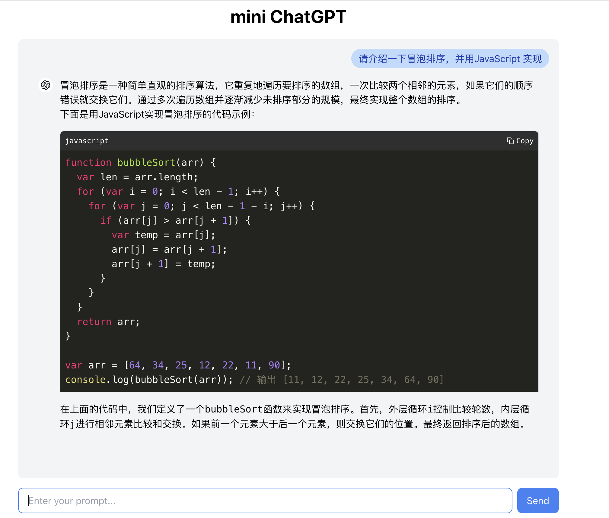

# ChatGPT Demo Application

This is a simple demo application using React for the frontend and Koa.js for the backend, designed to interact with the OpenAI API. The frontend allows users to input prompts and display responses from the GPT-4/gpt-3.5-turbo model. 
> 💡 **About model**: you can choose whatever you want by configuring in backend.

here is an example:


## Project Structure

```
mini-chatgpt
├─ README.md
├─ chatgpt-frontend
│  ├─ .dockerignore
│  ├─ Dockerfile
│  ├─ README.md
│  ├─ package-lock.json
│  ├─ package.json
│  ├─ pnpm-lock.yaml
│  ├─ public
│  │  ├─ favicon.ico
│  │  ├─ index.html
│  │  ├─ logo192.png
│  │  ├─ logo512.png
│  │  ├─ manifest.json
│  │  └─ robots.txt
│  ├─ src
│  │  ├─ App.css
│  │  ├─ App.js
│  │  ├─ App.test.js
│  │  ├─ components
│  │  │  ├─ ChatgptIcon.js
│  │  │  ├─ CodeBlock.js
│  │  │  ├─ MarkdownRenderer.js
│  │  │  └─ TypeWriter.js
│  │  ├─ index.css
│  │  ├─ index.js
│  │  ├─ logo.svg
│  │  ├─ pages
│  │  │  └─ ChatPage.js
│  │  ├─ reportWebVitals.js
│  │  ├─ router
│  │  │  └─ index.js
│  │  ├─ setupTests.js
│  │  └─ styles
│  │     └─ tailwind.css
│  └─ tailwind.config.js
├─ chatgpt-koa
│  ├─ .dockerignore
│  ├─ .env.local
│  ├─ Dockerfile
│  ├─ app.js
│  ├─ package.json
│  ├─ pnpm-lock.yaml
│  ├─ routes
│  │  ├─ chat.js
│  │  └─ index.js
│  └─ test.js
└─ docker-compose.yml

```

## Run in local environment

### Setup

Create a `.env` file in the `chatgpt-koa` directory and add your OpenAI API key:

```bash
OPENAI_API_KEY=your_openai_api_key
```

> 💡 [click to get a free OpenAI API key](https://github.com/chatanywhere/GPT_API_free)

### Run

choose one of the 2 ways:

#### docker

Build and Run the Containers

```sh
docker-compose up --build
```

This command will build and start both the frontend and backend containers.

#### local node environment

##### Prerequisites

- `node >= 16`
- If you haven't installed `pnpm`:
  ```bash
  npm install pnpm -g
  ```

##### Backend Service

enter the folder `/chatgpt-koa` and run:

```bash
pnpm i
pnpm start
```

##### Frontend Service

enter the folder `/chatgpt-frontend` and run:

```bash
pnpm i
pnpm start
```

The development server will start on http://localhost:3000.

## Usage

1. Open the application in your browser (http://localhost:3000).
2. Enter a prompt in the input field and click "Send".
3. The response from GPT will be displayed above the input field.
